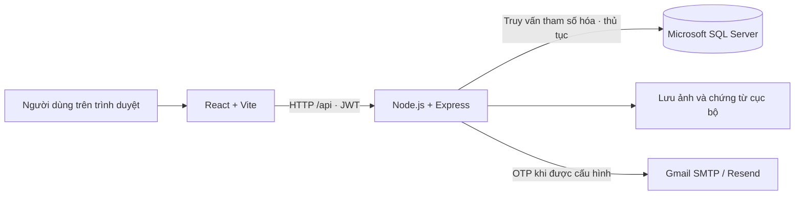

# HomeFix — Quản lý dịch vụ sửa chữa và bảo trì thiết bị tại nhà

Đồ án **Hệ quản trị cơ sở dữ liệu (DBMS330284)** của **Nhóm 08**, lớp **261DBMS330284_02**. HomeFix quản lý quy trình từ đặt dịch vụ, báo giá và phân công kỹ thuật viên đến nghiệm thu, thanh toán, đối soát và hỗ trợ sau dịch vụ. Ứng dụng web sử dụng React, API Express và Microsoft SQL Server; các ràng buộc và giao dịch nghiệp vụ được thực hiện trên CSDL thật.

**Kho mã nguồn:** [bndt0103/DBMS_HomeFix](https://github.com/bndt0103/DBMS_HomeFix)

## Mục lục

- [Thông tin nhóm](#thông-tin-nhóm)
- [Chức năng và vai trò](#chức-năng-và-vai-trò)
- [Kiến trúc và công nghệ](#kiến-trúc-và-công-nghệ)
- [Cấu trúc dự án](#cấu-trúc-dự-án)
- [Yêu cầu môi trường](#yêu-cầu-môi-trường)
- [Cài đặt và chạy](#cài-đặt-và-chạy)
- [Cấu hình môi trường](#cấu-hình-môi-trường)
- [Khởi tạo bằng SQL độc lập](#khởi-tạo-bằng-sql-độc-lập)
- [Tài khoản demo](#tài-khoản-demo)
- [Cơ sở dữ liệu và quy tắc nghiệp vụ](#cơ-sở-dữ-liệu-và-quy-tắc-nghiệp-vụ)
- [API chính](#api-chính)
- [Kiểm thử và công cụ](#kiểm-thử-và-công-cụ)
- [Quy trình demo](#quy-trình-demo)
- [Làm việc nhóm với Git](#làm-việc-nhóm-với-git)
- [Tài liệu và minh chứng](#tài-liệu-và-minh-chứng)
- [Xử lý lỗi thường gặp](#xử-lý-lỗi-thường-gặp)
- [Phạm vi hiện tại](#phạm-vi-hiện-tại)

## Thông tin nhóm

**Giảng viên hướng dẫn:** ThS. Phan Thị Thể. **Học kỳ:** 1, năm học 2026–2027.

| Thành viên | MSSV |
| --- | --- |
| Nguyễn Quốc Việt | 24110381 |
| Đỗ Anh Tuấn | 24110369 |
| Bùi Nguyễn Duy Trung | 24110363 |
| Lê Tấn Tài | 24110319 |

Thông tin theo báo cáo trong `DOC`. Bảng phân công ở phụ lục báo cáo là đề xuất chờ nhóm xác nhận; nhóm cần cập nhật theo công việc thực tế trước khi nộp.

## Chức năng và vai trò

| Vai trò | Mã | Chức năng chính |
| --- | --- | --- |
| Khách hàng | `KH` | Xem dịch vụ, đặt lịch, duyệt báo giá/vật tư/nghiệm thu, thanh toán, đánh giá, gửi yêu cầu hỗ trợ và hồ sơ đăng ký KTV |
| Kỹ thuật viên | `KTV` | Bật trạng thái sẵn sàng, nhận việc, cập nhật tiến độ/vị trí, đề xuất vật tư, gửi ảnh nghiệm thu, xem ví và thu nhập |
| Điều phối viên | `DPV` | Theo dõi đơn, lập báo giá sơ bộ, chọn và phân công KTV, xử lý lệnh điều phối, xem báo cáo |
| Chăm sóc khách hàng | `CSKH` | Tra cứu đơn, xử lý khiếu nại/bảo hành và lịch sử hỗ trợ, theo dõi chất lượng dịch vụ |
| Kế toán | `KT` | Xác minh chuyển khoản, quản lý tài khoản nhận tiền, đối soát, duyệt yêu cầu ví và báo cáo dòng tiền |
| Quản trị viên | `ADMIN` | Quản lý tài khoản, danh mục dịch vụ, đơn hàng, hồ sơ KTV, cấu hình và nhật ký hệ thống |
| Giám đốc | `GD` | Xem tổng quan điều hành, báo cáo tài chính/chất lượng/hiệu suất, duyệt đề xuất chính sách |

Hệ thống có đăng nhập bằng mật khẩu, OTP email cho đăng ký/khôi phục/đổi mật khẩu, thu hồi phiên đăng nhập và khóa tài khoản tạm thời. Ảnh, chứng từ và giấy tờ hồ sơ được kiểm tra quyền truy cập theo nghiệp vụ.

## Kiến trúc và công nghệ



| Thành phần | Công nghệ |
| --- | --- |
| Giao diện | React 19, React Router 7, Vite 7, Lucide React, CSS |
| API | Node.js, Express 5, Zod, Multer, Sharp |
| Xác thực và bảo vệ API | JWT, bcryptjs, Helmet, CORS, express-rate-limit |
| Truy cập CSDL | `mssql`; Windows Authentication qua `msnodesqlv8` và ODBC |
| Email OTP | Nodemailer/Gmail SMTP hoặc Resend |
| Kiểm thử và định dạng | Node.js Test Runner, Playwright, Prettier |
| Quản lý thư viện | npm workspaces cho `backend` và `frontend`, chung `SRC/package-lock.json` |

Khi phát triển, Vite ở cổng `5173` chuyển tiếp `/api` đến Express ở cổng `3000`. Khi chạy bản build, Express phục vụ cả API và giao diện tại cổng `3000`.

## Cấu trúc dự án

```text
DBMS_HomeFix/
├── README.md                       # Hướng dẫn chính
├── README.txt                      # Chỉ dẫn ngắn đến tài liệu
├── .gitignore
├── CAI_DAT.bat                     # Cài thư viện, khởi tạo CSDL, build web
├── CHAY_HOMEFIX_DBMS.bat            # Chạy bản build
├── SRC/
│   ├── package.json                # Các lệnh dùng chung và npm workspaces
│   ├── package-lock.json
│   ├── backend/
│   │   ├── .env.example            # Mẫu cấu hình API/CSDL/OTP
│   │   └── src/                    # Auth, đơn, báo giá, tài chính, hỗ trợ, báo cáo…
│   ├── frontend/
│   │   ├── .env.example
│   │   ├── public/                 # Icon và web manifest
│   │   └── src/                    # Trang và thành phần React theo nghiệp vụ
│   ├── database/                   # Schema, migration, SP, trigger, view, role
│   ├── scripts/                    # Init, test, export, metadata, benchmark
│   └── tests/                      # Kiểm thử API, SQL, OTP và giao diện
├── SQL/
│   └── 00_TaoLaiToanBoCSDL.sql      # SQLCMD: cấu trúc, quyền và dữ liệu mẫu
├── DOC/
│   ├── Nhom08_BaoCao_HQTCSDL_HomeFix.docx / .pdf
│   ├── DOI_CHIEU_YEU_CAU.md
│   ├── QUY_UOC_TEN_SQL.md
│   ├── images/                     # Sơ đồ và ảnh giao diện
│   └── evidence/                   # Metadata và kết quả kiểm tra đã lưu
└── SLIDES/
    └── Nhom08_ThuyetTrinh_HQTCSDL_HomeFix.pptx / .pdf
```

## Yêu cầu môi trường

- **Windows**, **Node.js >= 22.12**, npm và Git. Bộ minh chứng hiện có ghi nhận Node.js 24.19.
- **Microsoft SQL Server** đang chạy. Cấu hình mẫu dùng instance `localhost\SQLEXPRESS`; thay bằng instance thực tế trên máy bạn.
- **ODBC Driver 17 for SQL Server** khi dùng Windows Authentication.
- Kết nối Internet để cài thư viện lần đầu.
- **SSMS** hoặc `sqlcmd` nếu muốn chạy file SQL độc lập.
- **Microsoft Edge** để chạy bộ kiểm thử giao diện; có thể cấu hình `EDGE_PATH` đến trình duyệt Chromium tương thích.

Tài khoản dùng khởi tạo cần quyền tạo CSDL và các đối tượng bên trong. Bộ test tách biệt cần thêm quyền xóa CSDL thử. Không bắt buộc dùng tài khoản `sa`.

## Cài đặt và chạy

### 1. Clone dự án

```powershell
git clone https://github.com/bndt0103/DBMS_HomeFix.git
cd DBMS_HomeFix\SRC
npm ci
```

Cài tại `SRC` để npm cài cả hai workspace theo lockfile chung.

### 2. Cấu hình kết nối và khóa phiên

Nếu máy dùng đúng `localhost\SQLEXPRESS` và Windows Authentication như mẫu, có thể chuyển thẳng sang bước 3: `db:init` tự tạo `.env` và sinh `JWT_SECRET` khi file chưa tồn tại.

Nếu cần chỉnh instance hoặc kiểu xác thực, chạy:

```powershell
if (!(Test-Path backend/.env)) {
    Copy-Item backend/.env.example backend/.env
}
node -e "console.log(require('crypto').randomBytes(48).toString('base64url'))"
```

Mở `backend/.env`, sửa kết nối và dán chuỗi vừa sinh vào `JWT_SECRET`. File `.env` đã tồn tại sẽ không được `db:init` tự thay khóa mẫu; cần sửa khóa thủ công trong trường hợp này. Không ghi đè cấu hình riêng khi pull bản mới.

### 3. Khởi tạo, build và chạy

Chạy trong `SRC`:

```powershell
npm run db:init
npm run build
npm start
```

Mở **[http://localhost:3000](http://localhost:3000)**, đăng nhập bằng tài khoản demo bên dưới. Có thể kiểm tra kết nối CSDL qua [http://localhost:3000/api/health](http://localhost:3000/api/health). Dừng server bằng `Ctrl+C`.

`db:init` tạo CSDL nếu chưa có, áp dụng các script theo thứ tự và bổ sung dữ liệu mẫu. Script giữ tài khoản/mật khẩu mẫu đã tồn tại, không xóa CSDL. Chỉ chấp nhận tên CSDL có tiền tố `HomeFix_DBMS` và từ chối CSDL có bảng khác nhưng chưa có bảng phiên bản của HomeFix.

**Chạy bằng file `.bat`:** từ thư mục gốc, chạy `CAI_DAT.bat` lần đầu, sau đó `CHAY_HOMEFIX_DBMS.bat`. Nếu dùng instance khác cấu hình mẫu, tạo và sửa `SRC/backend/.env` trước khi chạy file cài đặt.

### 4. Chế độ phát triển

Sau khi khởi tạo CSDL, chạy trong `SRC`:

```powershell
npm run dev
```

Mở **[http://localhost:5173](http://localhost:5173)**. API tự khởi động lại khi sửa mã backend; Vite cập nhật giao diện khi sửa frontend. Nếu đổi cổng API, sửa proxy trong `SRC/frontend/vite.config.js` tương ứng.

## Cấu hình môi trường

### Backend: `SRC/backend/.env`

| Biến | Giá trị mẫu / ý nghĩa |
| --- | --- |
| `PORT` | `3000` — cổng API và web đã build |
| `DB_SERVER` | `localhost\SQLEXPRESS` — máy chủ/instance SQL Server |
| `DB_NAME` | `HomeFix_DBMS_Nhom08_TiengViet` — CSDL hiện tại |
| `DB_AUTH` | `windows`; đặt `sql` để dùng SQL Authentication |
| `DB_ODBC_DRIVER` | `ODBC Driver 17 for SQL Server` |
| `DB_ENCRYPT` | `false` trong mẫu cục bộ; `true` để bật mã hóa kết nối |
| `DB_USER`, `DB_PASSWORD` | Điền khi `DB_AUTH=sql` |
| `JWT_SECRET` | Khóa ngẫu nhiên ít nhất 32 ký tự; thay giá trị `replace-…` |
| `CLIENT_ORIGINS` | `http://localhost:5173,http://localhost:3000`; các origin được phép, cách nhau bằng dấu phẩy |
| `OTP_EMAIL_PROVIDER` | `gmail` hoặc `resend` |
| `GMAIL_USER` | Địa chỉ Gmail dùng gửi OTP |
| `GMAIL_APP_PASSWORD` | Google App Password, không dùng mật khẩu Gmail thông thường |
| `RESEND_API_KEY`, `OTP_EMAIL_FROM` | Cấu hình gửi OTP khi chọn Resend |

Tài khoản demo đăng nhập bằng mật khẩu, không cần cấu hình email. Đăng ký công khai và khôi phục mật khẩu cần nhà cung cấp OTP hợp lệ. Các địa chỉ `@homefix.local` là định danh demo, không nhận được thư.

### Frontend: `SRC/frontend/.env`

`VITE_API_BASE_URL` mặc định để trống nhằm gọi `/api` cùng origin; chế độ dev đã có proxy. Chỉ tạo file từ `.env.example` khi cần tùy chỉnh. Biến `VITE_*` được đưa vào bản build nên không chứa mật khẩu, JWT secret hay API key của nhà cung cấp email. Giao diện cũng có mục **Cài đặt kết nối** tại trang đăng nhập.

## Khởi tạo bằng SQL độc lập

Có thể dùng file SQL thay cho bước khởi tạo bằng Node.js. Trong SSMS, bật **Query → SQLCMD Mode**, mở [SQL/00_TaoLaiToanBoCSDL.sql](SQL/00_TaoLaiToanBoCSDL.sql) và thực thi. Hoặc chạy từ thư mục gốc:

```powershell
sqlcmd -S "localhost\SQLEXPRESS" -E -C -b -i "SQL/00_TaoLaiToanBoCSDL.sql"
```

File dùng `:setvar TenCSDL "HomeFix_DBMS_Nhom08_Import"` và **dừng nếu CSDL đã tồn tại**. Đổi `TenCSDL` nếu cần tạo một bản mới. Sau khi chạy, đặt `DB_NAME` trong `SRC/backend/.env` trùng tên đó, cấu hình JWT, cài thư viện rồi build/chạy web.

Tên file “Tạo lại” không có nghĩa là tự xóa hoặc ghi đè CSDL đang dùng. File chứa lược đồ, quyền và dữ liệu mẫu; không phải bản sao lưu toàn bộ dữ liệu vận hành và ảnh upload. Các script riêng trong `SRC/database` được chương trình chạy theo thứ tự định sẵn; không chạy ngẫu nhiên theo tên file.

**Nếu đang dùng bản lược đồ tiếng Anh cũ:** chọn CSDL mới `HomeFix_DBMS_Nhom08_TiengViet`, giữ cấu hình kết nối/JWT riêng rồi chạy init và build. Bản hiện tại không tự di chuyển dữ liệu từ lược đồ cũ.

## Tài khoản demo

**Mật khẩu khởi tạo chung: `HomeFix@123`**, chỉ phục vụ học tập/demo.

| Vai trò | Email đăng nhập |
| --- | --- |
| Khách hàng | `kh@homefix.local` |
| Kỹ thuật viên | `ktv@homefix.local` |
| Điều phối viên | `dpv@homefix.local` |
| CSKH | `cskh@homefix.local` |
| Kế toán | `kt@homefix.local` |
| Quản trị viên | `admin@homefix.local` |
| Giám đốc | `gd@homefix.local` |

Có thêm `kh2@homefix.local` và `ktv2@homefix.local` để kiểm tra quyền sở hữu dữ liệu. Nếu đã đổi mật khẩu tài khoản trên máy, chạy lại init không đặt lại mật khẩu đó. Mỗi thành viên có CSDL cục bộ riêng; pull mã nguồn không đồng bộ dữ liệu SQL Server của nhau.

## Cơ sở dữ liệu và quy tắc nghiệp vụ

Theo [metadata đã lưu](DOC/evidence/object-counts.json), CSDL có **30 bảng, 7 trigger, 6 view, 7 stored procedure, 5 function, 7 role** và **33 index ngoài khóa chính**. [Đối chiếu lược đồ](DOC/evidence/vietnamese-schema-check.json) ghi nhận 315 cột, 64 khóa ngoại và 95 ràng buộc CHECK/PRIMARY KEY/UNIQUE.

| Nhóm dữ liệu | Bảng tiêu biểu |
| --- | --- |
| Người dùng và xác thực | `NguoiDung`, `KyThuatVien`, `XacThucOTP`, `HoSoKTV` |
| Dịch vụ và đơn hàng | `DichVu`, `DonHang`, `BaoGiaSoBo`, `LenhDieuPhoi`, `LichSuDonHang` |
| Vật tư và nghiệm thu | `DeXuatVatTu`, `ChiTietDeXuatVatTu`, `PhieuNghiemThu`, `TepDinhKem` |
| Tài chính | `ThanhToan`, `DoiSoat`, `YeuCauVi`, `GiaoDichVi`, `TaiKhoanNhanTien`, `YeuCauThanhToan` |
| Hỗ trợ và quản trị | `DanhGia`, `YeuCauHoTro`, `LichSuHoTro`, `NhatKy`, `CauHinh`, `DeXuatChinhSach` |

Các điểm chính:

- Năm thủ tục ghi nghiệp vụ: `sp_TaoDonHang`, `sp_ChuyenTrangThaiDon`, `sp_DoiSoatCOD`, `sp_DuyetYeuCauVi`, `sp_XuLyHoTro`; có transaction, TRY…CATCH, rollback và savepoint để tham gia giao dịch ngoài.
- Trigger kiểm tra điều kiện nghiệp vụ, ghi nhật ký, cập nhật số dư ví và bảo vệ sổ ví/biên nhận khỏi sửa hoặc xóa trực tiếp.
- Dùng phiên bản dữ liệu để phát hiện thao tác trên bản cũ, khóa và chống lặp yêu cầu để tránh ghi nhận nhiều lần.
- Chính sách hủy được lưu theo thời điểm đặt đơn; các chứng từ có phiên bản để giữ lịch sử.
- Thanh toán gồm COD và chuyển khoản do kế toán xác minh. Gửi chứng từ tạo yêu cầu chờ duyệt; kế toán xác nhận mới ghi nhận khoản thu. Chưa kết nối ngân hàng tự động.
- Quyền SQL gồm `HomeFix_KH`, `HomeFix_KTV`, `HomeFix_DPV`, `HomeFix_CSKH`, `HomeFix_KT`, `HomeFix_ADMIN`, `HomeFix_GD`; có user minh họa `hf_<vai trò>` dạng WITHOUT LOGIN.
- Báo cáo tổng quan thực thi dưới user SQL tương ứng vai trò. Các API khác kết hợp kiểm tra vai trò, quyền sở hữu và quy tắc CSDL; chưa có Row-Level Security trên toàn hệ thống.

Tên bảng, cột và tham số nghiệp vụ dùng tiếng Việt không dấu theo PascalCase (`NgayTao`, `NguoiThucHienId`, `TrangThai`). [Quy ước tên SQL](DOC/QUY_UOC_TEN_SQL.md) giải thích ánh xạ SQL sang hợp đồng JSON hiện có.

## API chính

Các đường dẫn bên dưới có tiền tố `/api`. API nghiệp vụ được bảo vệ bằng `Authorization: Bearer <accessToken>` và quyền theo vai trò.

| Nhóm | Đường dẫn tiêu biểu |
| --- | --- |
| Kiểm tra và danh mục công khai | `GET /health`, `GET /services` |
| Xác thực | `/auth/login`, `/auth/register/otp`, `/auth/register`, `/auth/forgot-password/otp`, `/auth/reset-password`, `/auth/me`, `/auth/logout` |
| Đơn và điều phối | `/orders`, `/orders/:id`, `/orders/:id/history`, `/orders/:id/progress`, `/orders/:id/assignments`, `/assignments/:id/decision` |
| Báo giá và nghiệm thu | `/orders/:id/preliminary-quotes`, `/orders/:id/material-quotes`, `/orders/:id/acceptances` và các tuyến quyết định tương ứng |
| Thanh toán và ví | `/orders/:id/payments/cod`, `/payment-requests/:id/submit`, `/payment-requests/:id/decision`, `/settlements`, `/wallet-requests`, `/technicians/me/wallet` |
| Hỗ trợ và đánh giá | `/support/tickets`, `/orders/:id/reviews` |
| Quản trị và báo cáo | `/users`, `/settings`, `/audit-logs`, `/reports/summary`, `/reports/quality`, `/reports/performance`, `/reports/cashflow` |

Đối chiếu phương thức HTTP, dữ liệu đầu vào và quyền cụ thể trong [mã API](SRC/backend/src) và [bộ kiểm thử](SRC/tests). Đây là danh sách định hướng, không phải đặc tả đầy đủ mọi endpoint.

## Kiểm thử và công cụ

Chạy các lệnh trong `SRC`:

| Lệnh | Công dụng |
| --- | --- |
| `npm run dev` | Chạy API và Vite để phát triển |
| `npm run build` | Build frontend vào `frontend/dist` |
| `npm start` | Chạy API và phục vụ web đã build |
| `npm run db:init` | Khởi tạo/cập nhật CSDL và dữ liệu demo |
| `npm run test:isolated` | Tạo CSDL tạm, chạy server và test, sau đó xóa đúng CSDL tạm đó |
| `npm run test:all` | Build, test tách biệt và kiểm thử giao diện |
| `npm run test:e2e` | Chạy UI smoke/workflow trên server kiểm thử đã được chuẩn bị |
| `npm run format:check` | Kiểm tra định dạng mã |
| `npm run format` | Áp dụng định dạng Prettier |
| `npm run db:metadata` | Xuất metadata CSDL vào `DOC/evidence/schema.json` |
| `npm run db:export` | Xuất lược đồ/quyền và các bảng dữ liệu mẫu vào file SQL bàn giao |

```powershell
npm run test:isolated
# Kiểm tra đầy đủ, gồm giao diện Edge:
npm run test:all
npm run format:check
```

Ưu tiên test tách biệt: `npm test` chạy trực tiếp trên cấu hình hiện tại và các ca tích hợp có tạo/thay đổi dữ liệu. Không trỏ bộ test vào CSDL cần giữ. `test:isolated` tạo tên `HomeFix_DBMS_AutoTest_<mã ngẫu nhiên>`; các ca OTP cũng quản lý CSDL thử riêng. Kết quả lần chạy mới nằm trong `SRC/test-results` và không được commit.

**Minh chứng đã lưu trong dự án:** [full-test.log](DOC/evidence/full-test.log) ghi nhận **87/87 test đạt**, **26 trang desktop** và **16 thao tác workflow** đạt. Đây là kết quả được lưu từ lần chạy trước, không bảo đảm mọi máy mới clone đều đã có môi trường tương ứng. Các ca kiểm tra gồm phân quyền, OTP, thanh toán lặp, rollback, trigger nhiều dòng và hai kết nối SQL đồng thời duyệt ví.

Đo chỉ mục trên một CSDL thử đã được khởi tạo, từ `SRC`:

```powershell
$env:DB_NAME = 'HomeFix_DBMS_Nhom08_Test'
node scripts/benchmark-index.js
Remove-Item Env:DB_NAME
```

Script tạo 50.000 đơn trong transaction rồi rollback. [Kết quả đã lưu](DOC/evidence/index-benchmark.json) so sánh hai đường truy cập cưỡng bức cho cùng 50 kết quả: quét 16.729 logical reads, dùng index 2 logical reads. Đây là phép đo cục bộ cho một truy vấn, không phải cam kết hiệu năng chung.

`db:export` chỉ chấp nhận CSDL `HomeFix_DBMS_Nhom08_TiengViet` và xuất một số bảng mẫu; cần kiểm tra dữ liệu trước khi chia sẻ lại file SQL. Script không sao lưu toàn bộ dữ liệu nghiệp vụ hoặc nội dung upload.

## Quy trình demo

1. Mở các trình duyệt hoặc hồ sơ trình duyệt riêng cho KH, ĐPV, KTV và KT; đăng nhập tài khoản mẫu.
2. KH chọn dịch vụ và đặt lịch. ĐPV lập báo giá sơ bộ; KH duyệt.
3. KTV bật sẵn sàng. ĐPV phân công; KTV nhận việc và cập nhật tiến độ theo thứ tự.
4. KTV gửi đề xuất vật tư; KH duyệt. KTV gửi nghiệm thu và ảnh; KH xác nhận.
5. Thu COD hoặc KH gửi chứng từ chuyển khoản; KT xác minh và thực hiện đối soát.
6. Xem ví/thu nhập KTV, đánh giá của KH, yêu cầu hỗ trợ và báo cáo của từng vai trò.
7. Minh họa một thao tác bị từ chối do sai quyền hoặc dùng phiên bản cũ; trình bày SP, trigger, rollback và kiểm thử đồng thời trong SQL Server.

## Làm việc nhóm với Git

Thành viên mới clone theo phần cài đặt. Người đã clone cập nhật từ thư mục gốc khi cây làm việc sạch:

```powershell
git switch main
git pull --ff-only origin main
cd SRC
npm ci
npm run db:init
npm run build
```

Nếu có thay đổi chưa commit, lưu bằng commit trên nhánh riêng hoặc stash trước khi chuyển nhánh/pull. Khi cập nhật CSDL, kiểm tra `DB_NAME` trỏ đúng bản lược đồ tiếng Việt.

Mỗi công việc nên thực hiện trên một nhánh riêng:

```powershell
git switch -c feature/ten-chuc-nang
# Sửa mã và kiểm tra; chỉ stage các file thuộc công việc của mình.
git add <cac-file-da-sua>
git commit -m "Mo ta thay doi"
git push -u origin feature/ten-chuc-nang
```

Sau đó tạo Pull Request vào `main` để nhóm xem xét. Khi dependency thay đổi, commit cả `SRC/package.json`/manifest liên quan và `SRC/package-lock.json`. Khi SQL thay đổi, cập nhật script khởi tạo và hướng dẫn tương ứng.

`.gitignore` loại `.env`, thư viện `node_modules`, `dist`, `uploads`, kết quả test tạm và cache. Mỗi máy tự cấu hình `.env`, cài thư viện và tạo CSDL. `DOC`, `SLIDES` và log minh chứng trong `DOC/evidence` được giữ để nhóm pull tài liệu chung. Không đưa khóa JWT, mật khẩu SQL/email thật hoặc ảnh/chứng từ cá nhân lên repo.

## Tài liệu và minh chứng

| Tài liệu | Nội dung |
| --- | --- |
| [Báo cáo PDF](DOC/Nhom08_BaoCao_HQTCSDL_HomeFix.pdf) / [Word](DOC/Nhom08_BaoCao_HQTCSDL_HomeFix.docx) | Tổng quan, phân tích dữ liệu, đối tượng SQL, giao dịch/phân quyền, ứng dụng và kiểm thử; theo kiểm tra đã lưu: 86 trang, 72 trang nội dung chính |
| [Slide PDF](SLIDES/Nhom08_ThuyetTrinh_HQTCSDL_HomeFix.pdf) / [PowerPoint](SLIDES/Nhom08_ThuyetTrinh_HQTCSDL_HomeFix.pptx) | 12 slide trình bày và trình tự demo |
| [Đối chiếu yêu cầu](DOC/DOI_CHIEU_YEU_CAU.md) | Ánh xạ yêu cầu học phần với mã nguồn và minh chứng |
| [Quy ước tên SQL](DOC/QUY_UOC_TEN_SQL.md) | Quy tắc đặt tên và bảng đối chiếu tên cũ/mới |
| [Sơ đồ kiến trúc](DOC/images/architecture.png) | Các thành phần hệ thống |
| [ERD đơn hàng](DOC/images/erd-orders.png) / [ERD tài chính](DOC/images/erd-finance.png) | Quan hệ giữa các nhóm bảng |
| [Minh chứng](DOC/evidence) | Metadata, kiểm thử API/UI/SQL, kiểm tra import và phép đo index |

## Xử lý lỗi thường gặp

| Hiện tượng | Cách xử lý |
| --- | --- |
| Không kết nối SQL Server / `DATABASE_UNAVAILABLE` | Kiểm tra dịch vụ SQL, instance `DB_SERVER`, `DB_AUTH`, quyền tài khoản và ODBC Driver; tên instance có thể khác `SQLEXPRESS` |
| Server báo JWT secret không hợp lệ | Đặt khóa ngẫu nhiên >= 32 ký tự, thay giá trị `replace-…`; init chỉ tự sinh khóa khi `.env` chưa có |
| Cổng `3000` hoặc `5173` đã được dùng | Dừng tiến trình đang dùng hoặc đổi cổng; đồng bộ proxy, origin và URL truy cập |
| API chạy nhưng trang báo chưa build | Chạy `npm run build` trong `SRC`, sau đó `npm start` |
| `npm` bị PowerShell chặn script | Dùng `npm.cmd` thay `npm` cho các lệnh trong hướng dẫn |
| OTP chưa cấu hình / gửi thất bại | Kiểm tra Gmail App Password hoặc Resend; có thể dùng tài khoản demo để đăng nhập trước |
| SQLCMD báo CSDL đã tồn tại | Chọn `TenCSDL` mới; file SQL chủ động từ chối ghi đè CSDL cũ |
| API báo xung đột phiên bản hoặc không đủ điều kiện | Tải lại dữ liệu, kiểm tra vai trò, trạng thái đơn, số dư và các bước phê duyệt trước đó |
| Test UI không tìm thấy Edge | Cài Edge hoặc đặt `$env:EDGE_PATH` đến file trình duyệt tương thích |

## Phạm vi hiện tại

Dự án phục vụ học tập và demo trên trình duyệt, với bộ minh chứng giao diện desktop. Chuyển khoản được kế toán xác minh thủ công; vị trí được cập nhật qua thao tác ứng dụng. Hệ thống hiện dùng khóa lệnh chung ở API để đơn giản hóa kiểm soát đồng thời trong quy mô đồ án.

Hướng phát triển gồm thu hẹp quyền tài khoản dịch vụ, khóa theo đối tượng, chính sách lưu ảnh, kiểm thử tải, sao lưu/phục hồi theo thời điểm và tích hợp ngân hàng tự động. Cần cấu hình và đánh giá riêng trước khi đưa vào vận hành thực tế.
